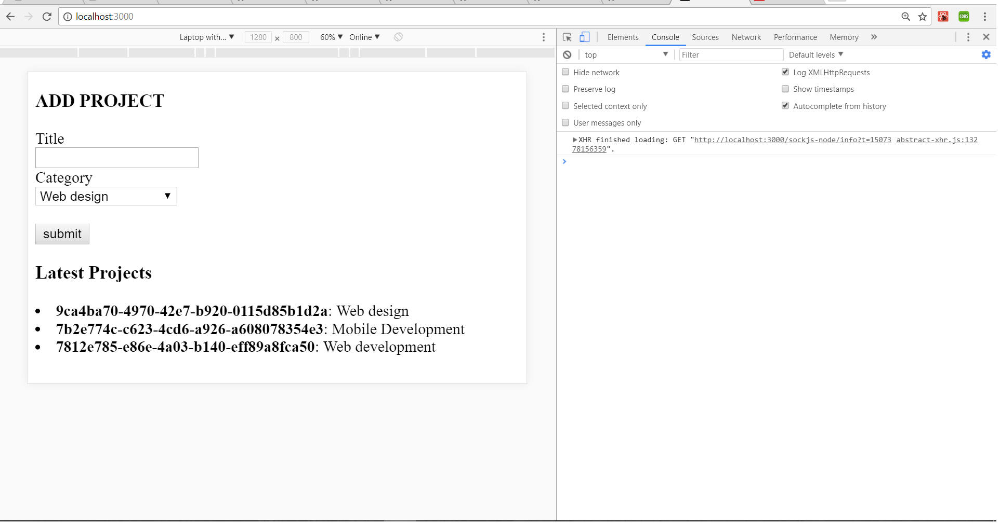
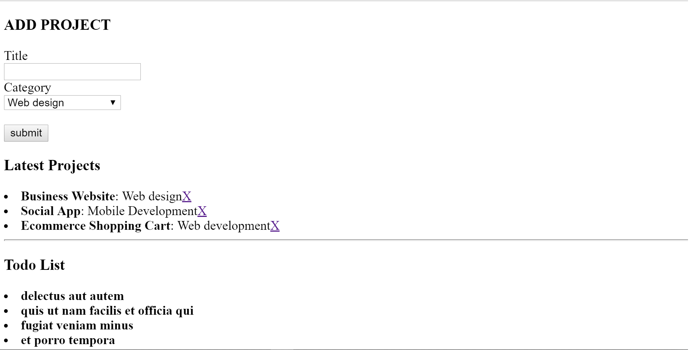

# React app 

## FEATURES:
* add title, delete and save
* choose catefory for saved title
* api for todos

This project was bootstrapped with [Create React App](https://github.com/facebookincubator/create-react-app).

Below you will find some information on how to perform common tasks.<br>
You can find the most recent version of this guide [here](https://github.com/facebookincubator/create-react-app/blob/master/packages/react-scripts/template/README.md).

## Table of Contents

## Folder Structure

After creation, your project should look like this:

```
my-app/
  README.md
  node_modules/
  package.json
  public/
    index.html
  src/
    App.css
    App.js
    App.test.js
    index.css
    index.js
    Components/
      AddProject.js
      ProjectItem.js
      Project.js
      TodoItem.js
      Todos.js
```

### `npm start`

Runs the app in the development mode.<br>
Open [http://localhost:3000](http://localhost:3000) to view it in the browser.

### for assigning ids, use uuid
* npm install --save uuid
* where to put

```
  app.js
  AddProject.js
  ProjectItem.js
```


### npm install --save prop-types
* usage: 
```
import PropTypes from 'prop-types';
```

* use in
```
  AddProject.js
  ProjectItem.js
  Projects.js
```

### bring in data from outside API
* lifecycleDidMount
```
  https://jsonplaceholder.typicode.com/todos
```

### npm install jquery --save

## sample plain image

